# Projet: Tatouage d’images chiffrées homomorphiquement

Membres :
- Abderrafik AMMI SAID
- William PFOHL


## Contexte

Ce projet vise à implémenter la méthode de tatouage sécurisée. Cette méthode permet l’insertion d’une marque à la fois dans le domaine en clair et chiffrée homomorphiquement.

Les différentes étapes à implémenter sont les suivantes:

1. Insertion de la marque lors de la phase de "**pré-traitement**"
2. Insertion dans le **domaine en clair** (ins1)
3. Insertion dans le **domaine chiffré** (ins2)
4. Extraction dans le **domaine chiffré**
5. Extraction dans le **domaine en clair**

#### Algorithme de tatouage

L'algorithme de tatouage que nous utiliseront est le QIM (Quantization Index Modulation) dont voici la description:

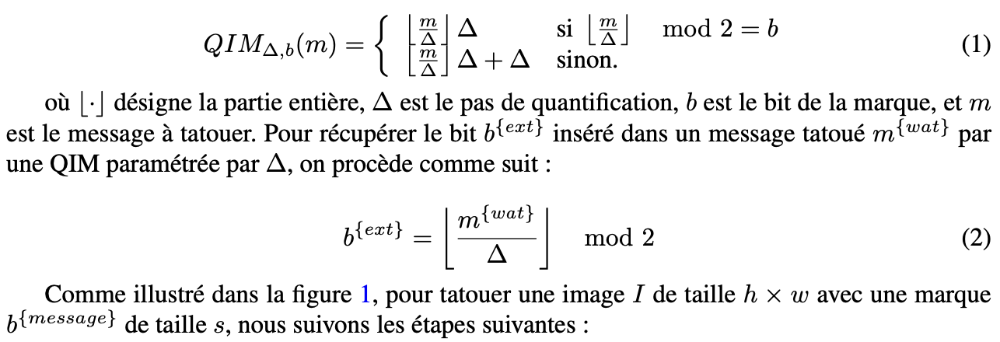


## Installation

Tout d'abord il faut s'assurer d'avoir Python installé et installer les dépendances nécessaires.

#### Installation de conda et gmpy2

```bash
!pip install -q condacolab
import condacolab
condacolab.install()
!conda install -c conda-forge gmpy2
```

#### Import des fonctions de calcul cryptographiques depuis gmpy2

```python
from gmpy2 import root, mpfr, cbrt, sqrt, c_div, is_prime, random_state, mpz_urandomb
from gmpy2 import bit_set, next_prime, bit_length, num_digits, mpz_random, gcd
from gmpy2 import invert, powmod, mpz
```

## 1. Insertion de la marque lors de la phase de "**pré-traitement**"

Avant l’insertion de la marque, l’image est convertie en un vecteur unidimensionnel, puis divisée en blocs de taille fixe. Une pré-marque est intégrée dans chaque bloc à l’aide de la modulation QIM (Quantization Index Modulation), facilitant ainsi l’insertion et l’extraction ultérieure de la marque principale. Enfin, le vecteur ainsi pré-marqué est chiffré en utilisant le cryptosystème homomorphe de Paillier, garantissant la sécurité des données tout au long du processus.

Voici les étapes successive de la phase de pré-traitement:

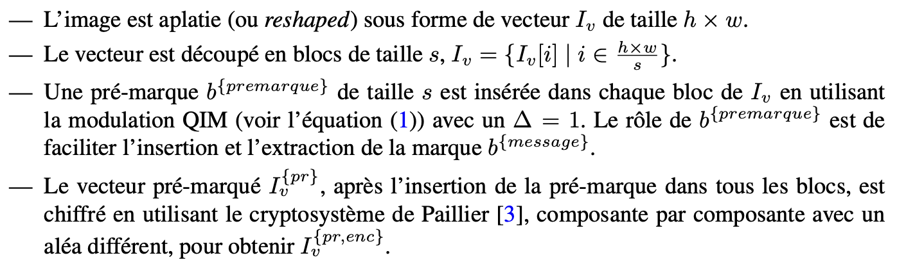

### Implémentation

Cela est fait en Python grâce aux fonctions image_to_grayscale_matrix, decouper_mat, reconstruire_matrice, generate_marque, mod_QIM, premarquage.


```python
#Conversion d'une image en niveau de gris
#Récupération de la matrice des pixels codés sur 8 bits

def image_to_grayscale_matrix(image_path):
    # Ouvrir l'image
    image = Image.open(image_path)

    # Convertir l'image en niveaux de gris
    grayscale_image = image.convert("L")

    # Convertir l'image en une matrice numpy
    grayscale_matrix = np.array(grayscale_image, dtype=np.uint8)

    return grayscale_matrix
```

```python
#Découpage d'une matrice en bloc de taille s
def decouper_mat(matrice,s):
    h, w = matrice.shape
    # Convertir la matrice en une liste plate
    liste_plate = matrice.flatten()
    # Découper la liste plate en sous-listes de taille s
    listes = [liste_plate[i:i +s] for i in range(0, len(liste_plate),s)]
    return listes

#Reconstruction de la matrice à partir des blocs de taille s
def reconstruire_matrice(listes, h, w):
    # Aplatir toutes les listes pour former une grande liste
    liste_plate = [item for sublist in listes for item in sublist]
    # Convertir la liste plate en une matrice de taille (h, w)
    matrice_reconstruite = np.array(liste_plate).reshape(h, w)
    return matrice_reconstruite

#Génération d'une marque aléatoire de taille s
def generate_marque(s):
  premarque = np.random.randint(0, 2, size=s)
  return premarque
```

```python
#Définition de l'algorithme de tatouage QIM (Quantization Index Modulation)
def mod_QIM(b,m,D):
  if (m//D)%2==b:
    I_marq_i=(m//D)*D
  else:
    if m==255 and b==0:
      I_marq_i=(m//D)*D-D #éviter la distorsion de l'image
    else:
      I_marq_i=(m//D)*D+D
  return I_marq_i

  #Premarquage de la matrice de pixel
#Application de l'algorithme de QIM à chaque pixel
def premarquage(premarque,I_v,D):
  I_marq=np.zeros(np.shape(I_v))
  #on parcourt l'ensemble des pixels que la matrice de blocs de taille s
  for i in range (np.shape(I_v)[0]):
    for j in range (np.shape(I_v)[1]):
      #on y applique l'algorithme de QIM
      I_marq[i][j]=mod_QIM(premarque[j],I_v[i][j],D)
  return I_marq
  ```

### Fonctions cryptographiques

Il est aussi nécessaire d'importer les fonctions nécessaires à la génération de clefs, le chiffrement et le déchiffrement de Paillier

  ```python
## Ce script contient l'ensemble des fonctions nécessaires
## à la génération de clefs, le chiffrement et le déchiffrement de Paillier

def get_prime(size): # size is the binary size
    # Get a random prime number of the specified bit size
    seed= random_state(time.time_ns())
    p = mpz_urandomb(seed,size)
    p = p.bit_set(size - 1)  # Ensure the number has exactly 'size' bits
    p = next_prime(p)

    # Verify primality using gmpy2's is_prime
    if is_prime(p) and p.bit_length() == size:
        return p
    return get_prime(size)

def get_paillier_keys(size):
  # Generate two large primes p and q (each of size/2 bits)
  p=get_prime(size // 2)
  q=get_prime(size // 2)
  while p==q:
    q=get_prime(size//2)

  # Calculate N = p*q
  N=p*q
  # Calculate phi(N) = (p-1)(q-1)
  phi_N= (p-1)*(q-1)
  # Set g = 1 + N
  g=1+N
  # Return public key (N, g) and private key (phi, p, q)
  pub_key=(N, g)
  priv_key=(phi_N, p, q)
  return pub_key, priv_key

def get_r(pub_key):
  # Generate a random number r with gcd(r, N) = 1
  N=pub_key[0]
  seed= random_state(time.time_ns())
  r=mpz_random(seed,N)
  while gcd(r,N)!=1 or r<3:
    seed= random_state(time.time_ns())
    r=mpz_random(seed,N)
  return r

def paillier_encrypt(message, pub_key):
  # Encrypt the message using Paillier cryptosystem
  # N = pub_key[0], g = pub_key[1]
  N = pub_key[0]
  g = pub_key[1]
  m=message
  r=get_r(pub_key)
  # c = (g^m * r^N) mod N^2
  c= (powmod(g,m,N**2)*powmod(r,N,N**2))%N**2
  return c

def paillier_decrypt_CRT(enc, priv_key, pub_key):
  #Decrypt using Chinese Remainder Theorem for improved performance
  phi_N=priv_key[0]
  p=priv_key[1]
  q=priv_key[2]

  N=pub_key[0]
  #L(u) = (u-1)/N
  u_p=powmod(enc,phi_N,p**2)
  u_q=powmod(enc,phi_N,q**2)

  v=(invert(q**2,p**2)*(u_p-u_q))%p**2
  u=u_q+v*q**2
  L_u=(u-1)//N

  inv_mu=invert(phi_N,N)

  # m = L(c^lambda mod N^2) * mu mod N
  m=(L_u*inv_mu)%N
  return m
  ```

### Application à la matrice de pixels

  ```python
  # Chiffrement de Paillier des pixels marqués de la matrice
def premarquage_encryption(I_v,pub_key):
  I_marq_enc=np.zeros(np.shape(I_v),dtype=object)
  for i in range (np.shape(I_v)[0]):
    if((i/np.shape(I_v)[0])*100)%5==0:print((i/np.shape(I_v)[0])*100) #permet d'afficher en pourcentage l'avancement du chiffrement
    for j in range (np.shape(I_v)[1]):
      message = I_v[i][j]
      # Chiffrement
      I_marq_enc[i][j]= paillier_encrypt(mpz(message), pub_key)
  return I_marq_enc

  # Déchiffrement de Paillier des pixels
def premarquage_decryption(I_v, priv_key, pub_key):
  I_marq_dec=np.zeros(np.shape(I_v),dtype=object)
  for i in range (np.shape(I_v)[0]):
    if((i/np.shape(I_v)[0])*100)%5==0:print((i/np.shape(I_v)[0])*100) #permet d'afficher en pourcentage l'avancement du chiffrement
    for j in range (np.shape(I_v)[1]):
      # Decrypt
      I_marq_dec[i][j]= paillier_decrypt_CRT(mpz(I_v[i][j]), priv_key, pub_key)
  return I_marq_dec
  ```

### Tests 

Il est possible de tester les fonctions définies auparavant.

  ```python

## TEST de la partie Prétraitement

# Accéder à l'image via le nom du fichier importé dans l'espace Google Colab
image_path = 'image_projet.jpg'  # Remplace par le nom du fichier téléchargé

# Conversion de l'image en niveau de gris et matrice de pixel codé sur 8 bits
grayscale_matrix = image_to_grayscale_matrix(image_path)
#print(grayscale_matrix)

# Affichage de la matrice de pixel
plt.imshow(grayscale_matrix, cmap='gray')
plt.axis('off')  # Masquer les axes
plt.show()

# Génération d'une prémarque aléatoire de taille 256
premarque=generate_marque(256)
#print("premarque=",premarque)

# Découpage de la matrice de pixels en bloc de taille s
listes=decouper_mat(grayscale_matrix,256)
#print("listes=",listes[0])

# Prémarquage de la matrice de pixels à l'aide de l'algorithme de QIM
listes_premarq=premarquage(premarque,listes,1)# D=1
#print("listes_premarq=",listes_premarq[0])

# Génération des clefs de Paillier
pub_key, priv_key = get_paillier_keys(256)
#print("pub_key=",pub_key)
#print("priv_key=",priv_key)

# Chiffrement de Paillier des pixels prémarqués de la matrice -- Attention l'exécution de cette fonction nécessite quelques minutes
listes_marq_enc=premarquage_encryption(listes_premarq,pub_key)#chiffrement du premarquage en 256 bit
#print("listes_marq_enc=",listes_marq_enc[0])

# Vérification en calculant le déchiffrement des pixels de la matrice
listes_marq_dec=premarquage_decryption(listes_marq_enc,priv_key,pub_key)
#print("listes_marq_dec=",listes_marq_dec[0])
```

```python
# TEST affichage de l'image après premarquage

# Reconstruction de l'image et conversion en float
image=reconstruire_matrice(listes_marq_dec.astype(float),np.shape(grayscale_matrix)[0],np.shape(grayscale_matrix)[1])

# Affichage de la matrice de piel
plt.imshow(image, cmap='gray')
plt.axis('off') # Masquer les axes
plt.show()
```
### Résultats

On obtient les résultats suivants, ce qui conclut avec succès la phase de pretraitement.


## 2. Insertion dans le domaine en **clair** (ins1)

L’insertion de la marque commence par le domaine en clair. La marque est ajoutée au vecteur pré-marqué via une opération homomorphe appliquée à sa version chiffrée. Cette étape permet d’assurer la cohérence de l’insertion entre les domaines en clair et chiffré, tout en préservant la structure des données et en maintenant leur intégrité.

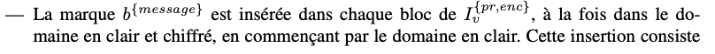
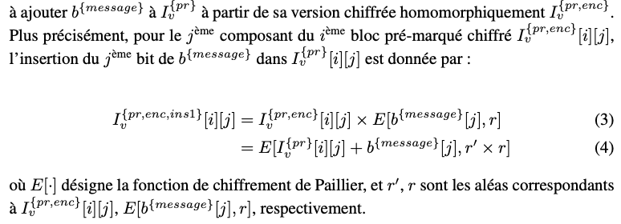

### Implémentation

```python
# Insertion d'un message dans le domaine clair de l'image
# Application de l'équation 3 du sujet

def ins1(I_v,message,pub_key):
  I_ins1=np.zeros(np.shape(I_v),dtype=object)
  enc_m=np.zeros(np.shape(I_v)[1],dtype=object)
  for j in range (np.shape(I_v)[1]):
    # Chiffrement de Paillier du bit du message à insérer
    enc_m[j] = paillier_encrypt(mpz(message[j]), pub_key)
    for i in range (np.shape(I_v)[0]):
      I_ins1[i][j]=(I_v[i][j]*enc_m[j])%pub_key[0]**2
      # ajout du bit du message dans le pixel de l'image en profitant de la propriété homomorphique du chiffrement de Paillier
      # le produit des deux chiffrés doit rester dans le groupe (N**2,*)
  return I_ins1
  ```

### Tests

Il est possible de tester la fonction d'insertion dans le domaine en clair.

  ```python
  ## TEST insertion dans le domaine clair

# Génération d'un message aléatoire à tatouer
message=generate_marque(256)# message à tatouer de taille s=256
#print("message=",message)

# Insertion du message dans le domaine clair
#récupération de la matrice prémarquée et chiffréé
I_enc_ins1=ins1(listes_marq_enc,message,pub_key)
#print(I_enc_ins1[0])

# Déchiffrement de la matrice tatouée par le message dans le domaine clair
dec_I_in1=premarquage_decryption(I_enc_ins1,priv_key,pub_key)
#print(dec_I_in1[0])

#test affichage de l'image après insertion
image=reconstruire_matrice(dec_I_in1.astype(float),np.shape(grayscale_matrix)[0],np.shape(grayscale_matrix)[1])
# Affichage de la matrice binaire
plt.imshow(image, cmap='gray')
plt.axis('off') # Masquer les axes
plt.show()
```

### Résultats

On obtient les résultats suivants, ce qui conclut avec succès l'insertion dans le domaine en clair.


## 3. Insertion dans le domaine **chiffré** (ins2)

L’insertion dans le domaine chiffré exploite les propriétés probabilistes du chiffrement de Paillier. L’algorithme ajuste aléatoirement le chiffrement jusqu’à ce que la marque intégrée corresponde au message prévu, sans altérer les valeurs en clair. Cette approche garantit une intégration robuste de la marque, tout en maintenant la sécurité et la confidentialité des données tatouées.

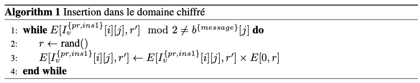

### Implémentation

```python
# Insertion d'un message dans le domaine chiffré de l'image (c'est-à-dire sur l'image chiffrée)

def ins2(I_ins1,message,pub_key):
  I_ins2=np.copy(I_ins1)
  for i in range (np.shape(I_ins2)[0]):

    if((i/np.shape(I_ins2)[0])*100)%5==0:print((i/np.shape(I_ins2)[0])*100) #permet d'afficher en pourcentage l'avancement de l'insertion

    for j in range (np.shape(I_ins2)[1]):

      while (I_ins2[i][j])%2!=mpz(message[j]): #tant que le pixel chiffré n'a pas la même parité que le bit du message à tatouer ...
        #print("in")
        #print((I_ins2[i][j]),message[j])

        I_ins2[i][j]=(I_ins2[i][j]*paillier_encrypt(mpz(0), pub_key))%pub_key[0]**2
        #modification de la parité du pixel chiffré sans modifié le pixel en clair (à l'aide de la propriété homomorphique du chiffrement Paillier)
        #à chaque itération le chiffré de 0 est différent grâce aux propriétés sémantiquement sûres du chiffrement de Paillier
        #le produit des deux chiffrés doit rester dans le groupe (N**2,*)

      #print("out")
  return I_ins2
  ```
Il est possible de tester la fonction d'insertion dans le domaine chiffré.

```python
## TEST insertion dans le domaine chiffré

# On récupère la matrice chiffrée précédente dans laquelle on a tatoué dans le domaine claire le message
# On récupère également le message à tatouer précédement généré de manière aléatoire
I_enc_ins1_ins2=ins2(I_enc_ins1,message,pub_key) #-- Attention l'exécution de cette fonction nécessite quelques minutes
print(I_enc_ins1_ins2)
```
### Résultats

On obtient les résultats suivants, ce qui conclut avec succès la phase d'insertion dans le domaine chiffré.

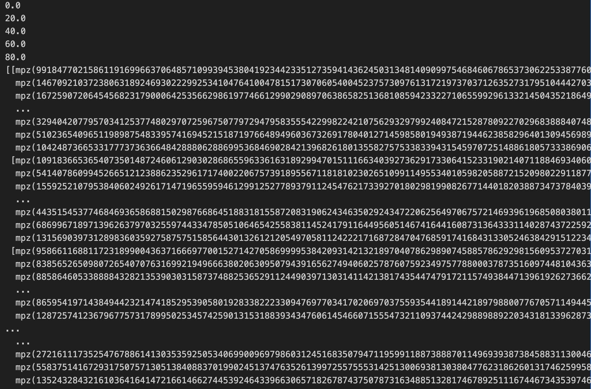


## 4. Extraction de la marque dans le domaine chiffré

Dans le domaine chiffré, l’extraction de la marque repose sur un simple calcul modulo 2 appliqué aux données chiffrées. Cette opération permet d’obtenir directement les bits de la marque insérée sans nécessiter de déchiffrement préalable, assurant ainsi une extraction sécurisée et efficace.

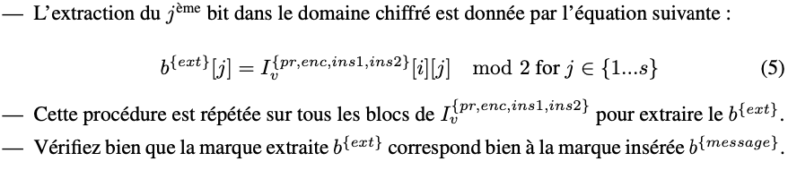

### Implémentations

```python
# Extraction du message tatoué dans le domaine chiffré

def ext1(I_enc_ins1_ins2):
  message_ext1=np.zeros(np.shape(I_enc_ins1_ins2),dtype=object)
  for i in range (np.shape(I_enc_ins1_ins2)[0]):
    for j in range (np.shape(I_enc_ins1_ins2)[1]):
      #on extrait le j-ème bit du message, en calculant le modulo 2 du j-ième pixel
      message_ext1[i][j]=(I_enc_ins1_ins2[i][j])%2
  if np.all(message_ext1 == message_ext1[0], axis=1).all():
    #comme on extrait un message à partir de chaque bloc
    #il est nécessaire de comparer les messages extraits des différents blocs pour s'assurer de l'intégrité
    return(message_ext1[0]) # s'il y a pas d'erreur d'intégrité, on retourne le message extrait du premier bloc

  return "integrity error" #si un message extrait d'un bloc diffère des autres messages extraits, une erreur d'intégrité est renvoyée
```
### Tests

Il est possible de tester les fonctions définies auparavant.

```python
## TEST extraction dans le domaine chiffré

#on récupère la matrice générée en sortie de l'insertion dans le domaine chiffré
message_ext_enc=ext1(I_enc_ins1_ins2)
#print(message_ext_enc)

#on compare le message extrait du domaine chiffré avec le message tatoué à l'origine:
print((message_ext_enc==message).all()) #renvoie True si les deux messages sont égaux
```

## 5. Extraction de la marque dans le domaine en clair

Dans le domaine en clair, l’extraction de la marque s’effectue en deux étapes. Tout d’abord, la modulation QIM inverse est appliquée au vecteur marqué afin de récupérer un premier message brut. Ensuite, une opération XOR est effectuée entre ce message et la pré-marque pour reconstituer la marque originale. Cette méthode garantit une récupération fiable et précise du tatouage inséré.

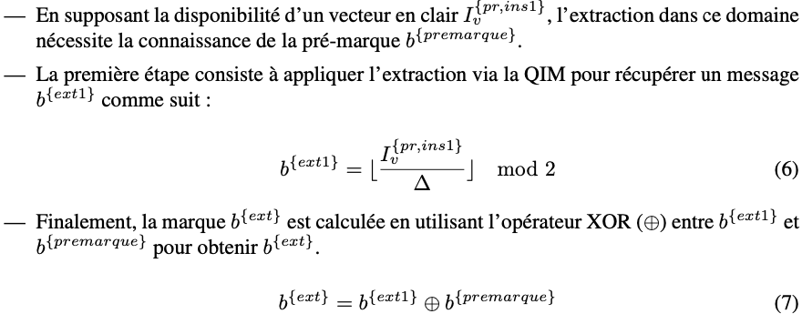
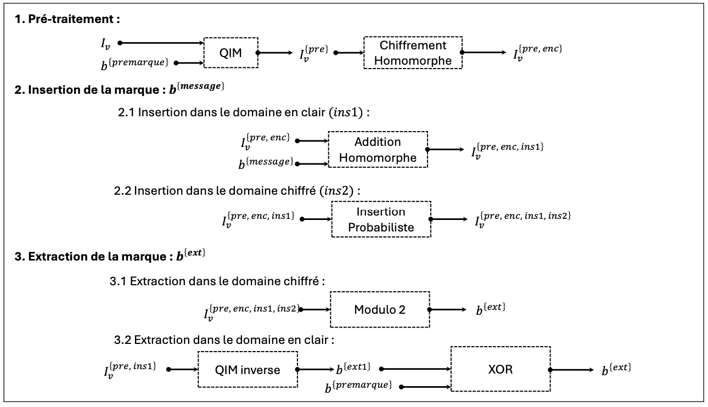
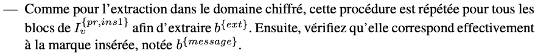

### Implémentation

```python
# Extraction du message tatoué dans le domaine clair

def ext2(I_v_ins1,premarque,D):
  message_ext1=np.zeros(np.shape(I_v_ins1)[1],dtype=object)
  message_ext2=np.zeros(np.shape(I_v_ins1),dtype=object)

  for i in range (np.shape(I_v_ins1)[0]):

    for j in range (np.shape(I_v_ins1)[1]):
      message_ext1[j]=(I_v_ins1[i][j]//D)%2
      #extraction du j-ième bit du message1 à partir du j-ième pixel de la matrice

    message_ext2[i]=message_ext1 ^ premarque
    #calcul du XOR entre la message1 extrait du bloc i et la premarque
    #ainsi on extrait le message du i-ème bloc de la matrice

  if np.all(message_ext2 == message_ext2[0], axis=1).all():
    #comme on extrait un message à partir de chaque bloc
    #il est nécessaire de comparer les messages extraits des différents blocs pour s'assurer de l'intégrité
    return(message_ext2[0]) # s'il y a pas d'erreur d'intégrité, on retourne le message extrait du premier bloc

  return "integrity error" #si un message extrait d'un bloc diffère des autres messages extraits, une erreur d'intégrité est renvoyée
```

### Tests

Il est possible de tester les fonctions définies auparavant.

```python
## TEST extraction dans le domaine clair

#récupération la matrice [déchiffrée] après l'insertion dans le domaine clair et la prémarque
message_ext_clair=ext2(dec_I_in1,premarque,1) #D=1
#print(message_ext_clair)

#on compare le message extrait du domaine clair avec le message tatoué à l'origine:
print((message==message_ext_clair).all()) #renvoie True si les deux messages sont égaux
```

### Résultats finaux

Nous obtenons bien "True", ce qui montre que notre implémentation est correcte.

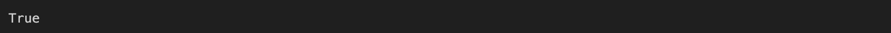

Ainsi nous avons réussi à implémenter la méthode de tatouage sécurisée proposée dans [1] qui permet l’insertion d’une marque à la fois dans le domaine en clair et chiffrée homomorphiquement en utilisant l'algorithme de tatouage QIM (Quantization Index Modulation)[2].

## Références

[1] Dalel Bouslimi, Reda Bellafqira, and Gouenou Coatrieux. Data hiding in homomorphically
encrypted medical images for verifying their reliability in both encrypted and spatial do-
mains. In *2016 38th Annual International Conference of the IEEE Engineering in Medicine
and Biology Society (EMBC), pages 2496–2499. IEEE, 2016.*

[2] Brian Chen and Gregory W Wornell. Quantization index modulation : A class of provably
good methods for digital watermarking and information embedding. *IEEE Transactions on
Information theory, 47(4) :1423–1443, 2001.*

[3] Pascal Paillier. Public-key cryptosystems based on composite degree residuosity classes. In
*International conference on the theory and applications of cryptographic techniques, pages
223–238. Springer, 1999.*
